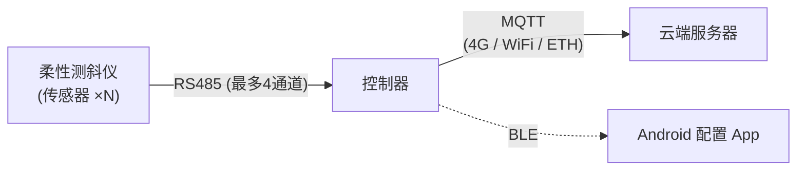

瑞茨柏测斜仪控制系统 
https://rasbertech.cn/

# 柔性测斜仪控制器系统

> 基于 的工业级柔性测斜仪数据采集与管理系统，包含 CircuitPython 嵌入式固件和 Android BLE 配置 App。

## 📖 项目简介

本项目是一套完整的 **柔性测斜仪（倾斜传感器）** 数据采集控制系统，应用于地质灾害监测、基坑位移监测、边坡稳定性分析等场景。系统通过 RS485 总线连接多达上千个传感器节点，采集倾斜角度数据 (A/B/Z 三轴)，并通过 4G/WiFi/以太网等方式将数据上报至云端服务器。

### 核心架构



---

## 📦 项目结构

```
├── firmware/                    # 嵌入式固件
│   ├── circuitpython/           #   CircuitPython 固件源码
│   │   ├── boot.py              #     USB CDC 配置
│   │   ├── code.py              #     主程序入口
│   │   ├── pins.py              #     硬件引脚定义 (44 GPIO)
│   │   ├── config.json          #     运行时配置
│   │   ├── app/                 #     应用层模块
│   │   │   ├── config_mgr.py    #       配置管理器
│   │   │   ├── data_formatter.py#       分段 JSON 格式化
│   │   │   ├── data_logger.py   #       本地 CSV 日志
│   │   │   └── upload_counter.py#       上传序号计数器
│   │   ├── drivers/             #     硬件驱动
│   │   │   ├── rs485.py         #       RS485 + DE/VCC 控制
│   │   │   ├── modem_4g.py      #       4G 模块 (SIM7672E)
│   │   │   ├── wifi.py          #       WiFi 连接
│   │   │   ├── ethernet.py      #       W5500 以太网
│   │   │   ├── voltage.py       #       ADC 电压监测
│   │   │   ├── power.py         #       电源管理 (休眠)
│   │   │   └── led.py           #       LED 状态指示
│   │   └── lib/                 #     通信协议库
│   │       ├── private_v2026.py #       私有协议 V2026
│   │       ├── modbus_rtu.py    #       Modbus RTU
│   │       └── ble_uart.py      #       BLE UART (NUS)
│   ├── deploy_circuitpython.sh  #   固件部署脚本
│   └── README.md                #   固件详细文档
│
├── android/                     # Android 配置 App
│   ├── app/                     #   应用源码
│   │   └── src/main/java/       #     Kotlin + Jetpack Compose
│   ├── build.gradle.kts         #   Gradle 构建配置
│   ├── gradle/                  #   Gradle Wrapper
│   └── README.md                #   App 使用说明
│
├── README.md                    # 本文件
├── git-push-guide.md            # Git 推送指南
└── .gitignore
```

---

## ✨ 功能特性

### 🔧 固件 (CircuitPython 10.x - 同步架构)

| 类别 | 功能 | 说明 |
|:---|:---|:---|
| **传感器采集** | 多通道 RS485 | 2 通道硬件 UART + 2 通道 SC16IS752 I2C 扩展 |
| | 多协议支持 | 私有协议 V2026 / Modbus RTU |
| | 地址扫描 | AutoID 0-1023 范围扫描，实时反馈进度 |
| | 批量操作 | 批量写地址、写型号、设置 Modbus ID |
| **数据上报** | 4G MQTT | SIM7672E 模块，PSM 省电模式 |
| | WiFi MQTT | 备选无线上报通道 |
| | W5500 以太网 | 有线网络上报 |
| | USB CDC | 本地串口数据输出 |
| | 分段 JSON | 自动分段，每段最多 15 个传感器 |
| **低功耗** | 深度休眠 | ~10µA，支持定时唤醒 |
| | 轻度休眠 | ~130µA，RTC 持续走时 |
| | 采集间隔 | 5 分钟 ~ 24 小时可配 |
| **配置管理** | BLE 蓝牙配置 | Nordic UART Service (NUS) |
| | USB CDC 命令 | 完整的命令行接口 |
| | NVM 模式控制 | 设备/电脑读写模式即时切换 |
| **数据存储** | 本地 CSV | 按日/月自动分文件存储 |
| | USB 读取 | 作为 U 盘直接访问数据文件 |
| **其他** | OTA 更新 | HTTP 远程固件更新 |
| | 自动注册 | 首次启动从服务器获取设备 ID (YYYY75XXXX) |
| | 时间同步 | 4G > WiFi NTP > ETH NTP > BLE 手机同步 |

### 📱 Android App (Kotlin + Jetpack Compose)

| 页面 | 功能 | 说明 |
|:---|:---|:---|
| **连接页** | BLE 扫描与连接 | 自动发现 UniControl 设备，PIN 配对 |
| **配置页** | A4 全扫 | 扫描 COM 口上所有传感器 |
| | 地址/型号修改 | 一对一更新传感器地址 (A7) 和型号 (C7) |
| | Modbus ID 设置 | 为传感器分配 Modbus 地址 (AB) |
| | 批量写地址 | 按 AutoID 范围扫描并写入固定地址 (A0) |
| **数据页** | 扫描/读取数据 | 实时采集 A/B/Z 三轴数据 |
| | 型号管理 | 批量读取/设置传感器型号 |
| **设置页** | 设备配置 | ID、采集间隔、休眠模式 |
| | 网络配置 | 4G (APN/运营商)、WiFi、MQTT |
| | 高级设置 | 485 扩展、合并报文、本地存储、U盘模式 |

---

## 🔌 硬件规格

| 参数 | 规格 |
|:---|:---|
| **主控芯片** | N16R8 |
| **Flash** | 16MB |
| **PSRAM** | 8MB |
| **GPIO 使用** | 44 / 48 |
| **RS485 通道** | 2 硬件 UART + 2 SC16IS752 扩展 (可选) |
| **4G 模块** | SIM7672E |
| **以太网** | W5500 SPI (可选) |
| **ADC** | 7 通道 ADC1 电压监测 |
| **BLE** | Nordic UART Service |
| **USB** | CDC 数据端口 + Mass Storage |

### 通信接口

| 通道 | 类型 | TX | RX | DE | VCC | ADDR |
|:---:|:---|:---:|:---:|:---:|:---:|:---:|
| COM1 | 硬件 UART | GPIO17 | GPIO18 | GPIO16 | GPIO4 | GPIO15 |
| COM2 | 硬件 UART | GPIO38 | GPIO39 | GPIO40 | GPIO41 | GPIO42 |
| COM3 | SC16IS752 | I2C | I2C | GPIO11 | GPIO12 | GPIO13 |
| COM4 | SC16IS752 | I2C | I2C | GPIO14 | GPIO27 | GPIO28 |

---

## 📡 数据上报格式

传感器数据通过 MQTT 以分段 JSON 格式上报：

**头信息段 (seg: 0/n)**
```json
{
  "cid": 2026750055,
  "v": "2026.02.09-sync",
  "sdt": "107",
  "vin": 12.35,
  "clock": "2/5/2026 22:30:00",
  "time": 1738765800,
  "hib": 5,
  "signal": "CSQ:31,99",
  "sid1num": 25,
  "seg": "0/2"
}
```

**数据段 (seg: 1/n)** — 地址降序排列（底端在前）
```json
{
  "cid": 2026750055,
  "time": 1738765800,
  "seg": "1/2",
  "data": [
    [26110025, -0.55, 0.71, "C", 1, 998.70],
    [26110024, -0.52, 0.68, "C", 1, 999.20],
    [26110001, -0.15, 0.23, "C", 1, 1001.50]
  ]
}
```

数据格式: `[地址, A轴角度, B轴角度, 状态, 1, Z轴]`，状态 `C` = 正常, `W` = 无响应

---

## 🔋 USB 读写模式

基于 NVM (非易失性内存) 实现设备/电脑读写权限控制：

| nvm[0] | 模式 | 设备 | 电脑 |
|:---:|:---|:---:|:---:|
| **17** | 日常模式 | **读写** | 只读 |
| 其他值 | 烧录模式 | 只读 | **读写** |
| - | 无 USB 连接 | **读写** | N/A |

切换命令: BLE `set_usb_rw` / CDC `#enable_usb_rw` / `#disable_usb_rw`

---

## 🚀 快速开始

### 固件部署

```bash
cd firmware
./deploy_circuitpython.sh
```

### Android App 构建

```bash
cd android

# Debug 版本
./gradlew assembleDebug

# Release 版本
./gradlew assembleRelease
```

---

## 📖 详细文档

| 文档 | 说明 |
|:---|:---|
| [固件 README](firmware/README.md) | 固件详细说明、引脚定义、CDC/BLE 命令集 |
| [Android README](android/README.md) | App 功能说明和构建指南 |
| [Git 推送指南](git-push-guide.md) | 代码推送到 GitHub 的操作指南 |

---

## 📜 许可证

MIT License
